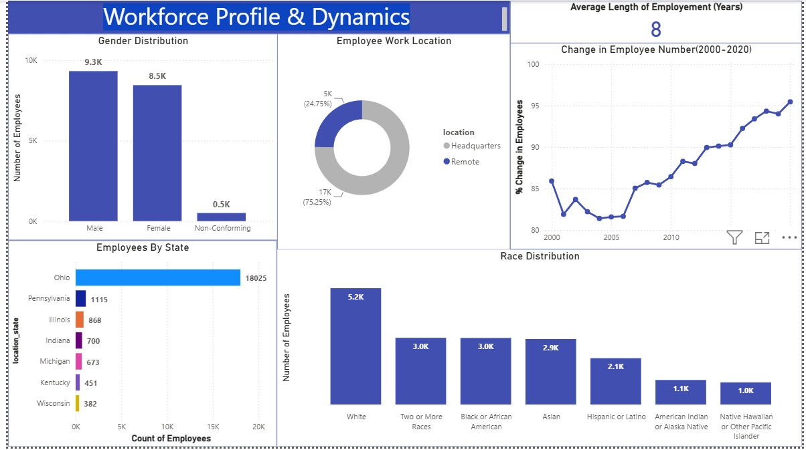
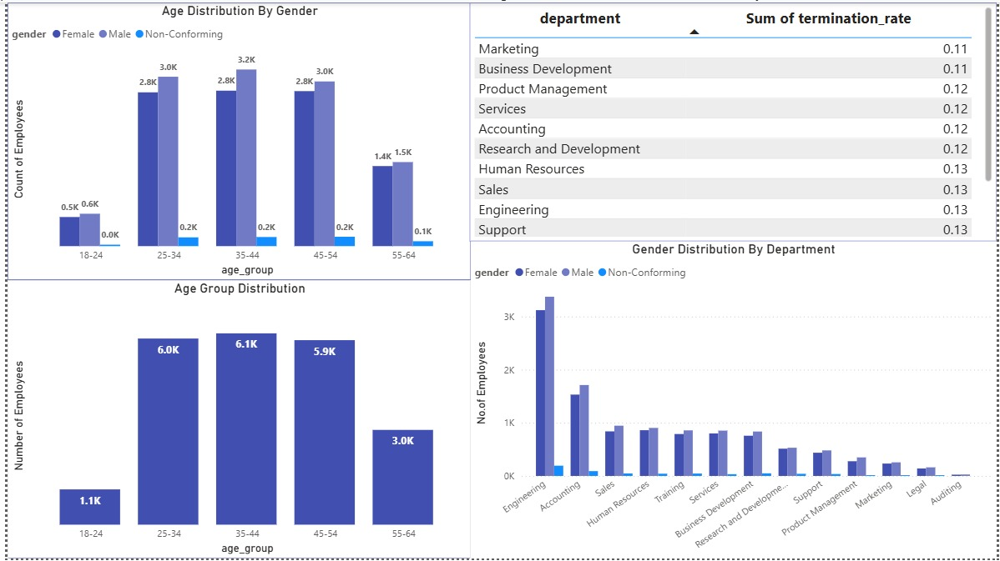

# 📊 HR Employee Performance & Attrition Dashboard

## 📁 Project Overview
This repository features an end-to-end HR Analytics solution designed to track workforce composition, monitor tenure metrics, and uncover departmental turnover risks. By bridging robust **MySQL** database transformations with a highly polished **Power BI** executive dashboard and data storytelling, this project delivers actionable business intelligence to optimize human resource decision-making.

---

## 🧭 Project Workflow & Data Architecture

### 1️⃣ Advanced Data Engineering in MySQL
Raw workforce data underwent a rigorous extract, transform, and load (ETL) pipeline within MySQL. The SQL logic handled:
*   **Data Quality Assurance (`datacleaning.sql`):** Standardizing date formats, resolving null entries, and cleaning inconsistent structural records.
*   **Feature Engineering & Aggregation (`dataanalysis.sql`):** Generating business-critical dimensions including dynamic age brackets, precise employee tenure calculations, and historical turnover markers to shift processing loads away from the visual layer.

### 2️⃣ Premium Power BI Business Intelligence (`Workforce Profile & Dynamics.pbix`)
The final dashboard was built away from standard Power BI defaults, focusing on modern corporate design patterns, accessibility, scannability, and high executive utility.

#### 📌 Page 1: Workforce Profile & Dynamics
Focuses on organizational demographic profiles, geographic mapping, and enterprise-wide tenure trends.
*   **Avg. Tenure:** Tracks overall organizational stability (averaging 8+ years).
*   **Geographic Distribution:** Maps dynamic regional hiring footprints (dense concentration in Ohio and Pennsylvania).
*   **Decluttered Visuals:** Removed redundant axis elements to let pure data labels drive clarity.

#### 📌 Page 2: Demographics & Retention Analysis
A focused deep-dive into departmental friction points, gender parity, and aging distributions.
*   **Attrition Hotspots:** Ranks departments dynamically by turnover severity to identify units requiring urgent HR policy reviews.
*   **Horizontal Layout Optimization:** Reconfigured department metrics from vertical to horizontal layouts, allowing seamless left-to-right scanning of long corporate names without truncation.

---

## 📊 Dashboard Previews

### Page 1: Workforce Profile & Dynamics Overview


### Page 2: Demographics & Retention Analysis


---

## 📂 Repository Structure
```text
HR-Employee-Performance-Attrition-Dashboard/
│
├── 📜 datacleaning.sql                 # Data cleaning & format standardization scripts
├── 📜 dataanalysis.sql                 # Metric generation, feature engineering & insights queries
├── 📊 Workforce Profile & Dynamics.pbix # High-performance interactive Power BI Dashboard
├── 📋 Executive_Business_Report.md     # Comprehensive Business Report & HR Recommendations (New)
├── 📄 Resources.csv                    # Raw organizational source dataset
├── 🖼️ Page_1.jpeg                       # Dashboard Page 1 Screenshot View
└── 🖼️ Page_2.jpeg                       # Dashboard Page 2 Screenshot View
